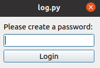

# Encrypted Log/Diary
### This is a small personal project which is an encrypted log/diary in Python3 using PyQt5 for GUI

The user will set the desired file destination in the config.py file.

Then run log.py in Python3

When you first open the program the screen will ask for a password

You will then be greeted with this screen asking if you want to read or add to the log. You can open the read screen by pressing 'r' and the add screen by pressing 'a' on your keyboard

After you click the read screen you will see this new window

The add window looks like this. You can add to the file by pressing the button at the bottom of the window or simply pressing enter

When you open the window in the future after the key has been generated the screen will look like this

Finally, if you type the password incorrectly you will receive this error below

